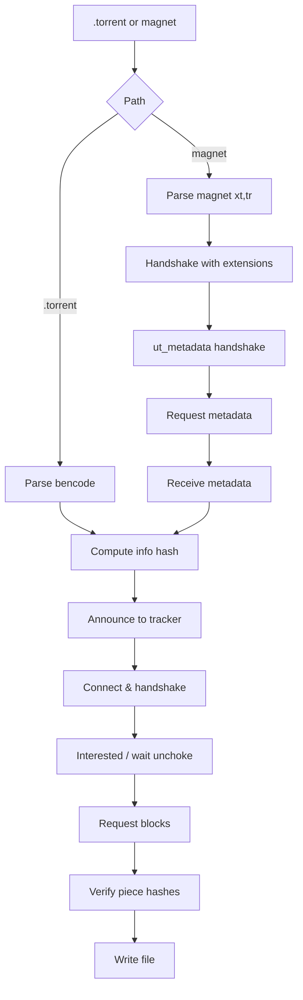

## Stages

This page walks through the major stages of TorrentX, mapping each concept to the exact logic implemented in code. Code snippets are simplified excerpts from `src/main/java/Main.java` for clarity.



### Decode bencoded strings

Strings in bencode are encoded as `<length>:<bytes>`. The parser reads a decimal length followed by `:` and then the raw bytes.

```java
// parseElement: string branch
if (Character.isDigit(c)) {
  int i = startIndex;
  while (i < input.length() && Character.isDigit(input.charAt(i))) i++;
  if (i >= input.length() || input.charAt(i) != ':') throw new RuntimeException("Invalid string length encoding");
  int length = Integer.parseInt(input.substring(startIndex, i));
  int begin = i + 1;
  int end = begin + length;
  if (end > input.length()) throw new RuntimeException("String extends beyond input length");
  return new ParseResult(input.substring(begin, end), end);
}
```

### Decode bencoded integers

Integers are encoded as `i<number>e`.

```java
// parseElement: integer branch
else if (c == 'i') {
  int end = startIndex + 1;
  while (end < input.length() && input.charAt(end) != 'e') end++;
  if (end >= input.length()) throw new RuntimeException("Unterminated integer");
  String numberPortion = input.substring(startIndex + 1, end);
  long value = Long.parseLong(numberPortion);
  Object number = (value >= Integer.MIN_VALUE && value <= Integer.MAX_VALUE) ? (int) value : value;
  return new ParseResult(number, end + 1);
}
```

### Decode bencoded lists

Lists are encoded as `l ... e`, where each element is another bencoded value.

```java
private static ParseResult parseList(String input, int startIndex) {
  if (input.charAt(startIndex) != 'l') throw new RuntimeException("List must start with 'l'");
  int index = startIndex + 1;
  List<Object> elements = new ArrayList<>();
  while (index < input.length()) {
    char c = input.charAt(index);
    if (c == 'e') return new ParseResult(elements, index + 1);
    ParseResult element = parseElement(input, index);
    elements.add(element.value);
    index = element.nextIndex;
  }
  throw new RuntimeException("Unterminated list");
}
```

### Decode bencoded dictionaries

Dictionaries are encoded as `d ... e` with string keys in lexicographical order.

```java
private static ParseResult parseDict(String input, int startIndex) {
  if (input.charAt(startIndex) != 'd') throw new RuntimeException("Dictionary must start with 'd'");
  int index = startIndex + 1;
  Map<String, Object> map = new LinkedHashMap<>();
  while (index < input.length()) {
    char c = input.charAt(index);
    if (c == 'e') return new ParseResult(map, index + 1);
    if (!Character.isDigit(c)) throw new RuntimeException("Dictionary keys must be strings");
    ParseResult keyParsed = parseElement(input, index);
    String key = (String) keyParsed.value;
    index = keyParsed.nextIndex;
    ParseResult valueParsed = parseElement(input, index);
    map.put(key, valueParsed.value);
    index = valueParsed.nextIndex;
  }
  throw new RuntimeException("Unterminated dictionary");
}
```

### Parse torrent file

The `.torrent` file is read from `~/Downloads/<torrent_file>`, decoded as bencode, and the `announce` URL and `info` dictionary are extracted.

```java
Path torrentFilePath = Paths.get(System.getProperty("user.home"), "Downloads", torrentFileName);
byte[] bytes = Files.readAllBytes(torrentFilePath);
String bencoded = new String(bytes, StandardCharsets.ISO_8859_1);
Object decoded = decodeBencode(bencoded);
Map<String, Object> top = (Map<String, Object>) decoded;
String trackerUrl = (String) top.get("announce");
Map<String, Object> info = (Map<String, Object>) top.get("info");
```

### Calculate info hash

The info hash is the SHA‑1 of the canonical bencoded `info` dictionary.

```java
byte[] infoBencoded = bencode(info);
byte[] infoHash = MessageDigest.getInstance("SHA-1").digest(infoBencoded);
```

### Piece hashes

The `pieces` field is a concatenation of 20-byte SHA‑1 hashes, one per piece.

```java
byte[] piecesBytes = piecesStr.getBytes(StandardCharsets.ISO_8859_1);
int numPieces = piecesBytes.length / 20;
byte[] expectedHash = new byte[20];
System.arraycopy(piecesBytes, p * 20, expectedHash, 0, 20);
```

### Discover peers

Announce to the tracker with a compact peer list request.

```java
String url = buildTrackerUrl(trackerUrl, infoHash, peerId, 6881, 0, 0, totalLen, 1);
HttpClient client = HttpClient.newHttpClient();
HttpResponse<byte[]> response = client.send(request, HttpResponse.BodyHandlers.ofByteArray());
```

The compact response is parsed into an IPv4 address and port.

```java
byte[] peersBytes = peersStr.getBytes(StandardCharsets.ISO_8859_1);
int b0 = peersBytes[0] & 0xFF, b1 = peersBytes[1] & 0xFF, b2 = peersBytes[2] & 0xFF, b3 = peersBytes[3] & 0xFF;
String host = b0 + "." + b1 + "." + b2 + "." + b3;
int port = ((peersBytes[4] & 0xFF) << 8) | (peersBytes[5] & 0xFF);
```

### Peer handshake

For `.torrent` downloads, a standard BitTorrent handshake is sent.

```java
byte[] handshake = buildHandshake(infoHash, peerIdBytes);
os.write(handshake);
byte[] respHs = readN(is, 68);
```

For magnet downloads, the handshake advertises extension protocol support.

```java
byte[] handshake = buildHandshakeWithExtensions(infoHash, peerIdBytes);
// reserved[5] = 0x10 indicates extension protocol (BEP 10)
```

### Download a piece

TorrentX pipelines block requests for a piece and then reads `piece` messages (id 7), assembling the piece in memory.

```java
final int blockSize = 16 * 1024;
while (remaining > 0) {
  int reqLen = Math.min(blockSize, remaining);
  sendRequest(os, p, offset, reqLen);
  offset += reqLen;
  remaining -= reqLen;
}
// read messages until piece is filled
if (msg.id == 7) {
  int begin = readInt(msg.payload, 4);
  int dataLen = msg.payload.length - 8;
  System.arraycopy(msg.payload, 8, pieceData, begin, dataLen);
}
```

### Download the whole file

Each piece is SHA‑1 verified against the `pieces` table before being written to disk.

```java
byte[] calc = MessageDigest.getInstance("SHA-1").digest(pieceData);
for (int i = 0; i < 20; i++) if (calc[i] != expectedHash[i]) throw new RuntimeException("Piece hash mismatch");
fos.write(pieceData);
```

---

## Magnet Links

### Parse magnet link

TorrentX parses `xt` (info hash) and `tr` (tracker) parameters.

```java
for (String p : query.split("&")) {
  int eq = p.indexOf('=');
  String key = eq >= 0 ? p.substring(0, eq) : p;
  String val = eq >= 0 ? p.substring(eq + 1) : "";
  val = URLDecoder.decode(val, StandardCharsets.UTF_8);
  if ("tr".equals(key)) trackerUrl = val;
  if ("xt".equals(key) && val.startsWith("urn:btih:")) infoHashHex = val.substring(9).toLowerCase();
}
```

### Announce extension support

The handshake sets the extension bit.

```java
byte[] reserved = new byte[8];
reserved[5] = 0x10; // extension protocol
```

### Send extension handshake

TorrentX advertises `ut_metadata` in the extension handshake (BEP 10).

```java
Map<String, Object> m = new LinkedHashMap<>();
m.put("ut_metadata", utMetadataId);
Map<String, Object> root = new LinkedHashMap<>();
root.put("m", m);
byte[] dict = bencode(root);
// send as: <len><20><0><dict>
```

### Receive extension handshake

The peer replies with an extension handshake carrying its `ut_metadata` message id.

```java
if (m.id == 20 && m.payload.length > 0 && (m.payload[0] & 0xFF) == 0) {
  String dictStr = new String(m.payload, 1, m.payload.length - 1, StandardCharsets.ISO_8859_1);
  Object d = decodeBencode(dictStr);
  // read root['m']['ut_metadata']
}
```

### Request metadata

TorrentX sends an extended message with `msg_type = 0` (request) and `piece = 0`.

```java
Map<String, Object> req = new LinkedHashMap<>();
req.put("msg_type", 0);
req.put("piece", 0);
byte[] hdr = bencode(req);
// payload: <20><ut_metadata_id><bencoded header>
```

### Receive metadata

TorrentX expects an extended message with `msg_type = 1` (data) and parses the bencoded metadata.

```java
if (m.id == 20 && m.payload.length > 1 && (m.payload[0] & 0xFF) == peerUtMetadataId) {
  int headerLen = bencodeElementLength(m.payload, 1);
  String hdrStr = new String(m.payload, 1, headerLen, StandardCharsets.ISO_8859_1);
  Object ho = decodeBencode(hdrStr);
  // metadata bytes follow the header
}
```

### Download a piece (after metadata)

Same strategy as the `.torrent` path: pipeline requests, assemble, verify piece hash.

### Download the whole file (after metadata)

Iterate through all pieces, verify, and write to `~/Downloads/<name>`.

---

### Reference

- BEP 3: The BitTorrent Protocol Specification
- BEP 9: Extension for Peers to Send Metadata Files
- BEP 10: Extension Protocol


